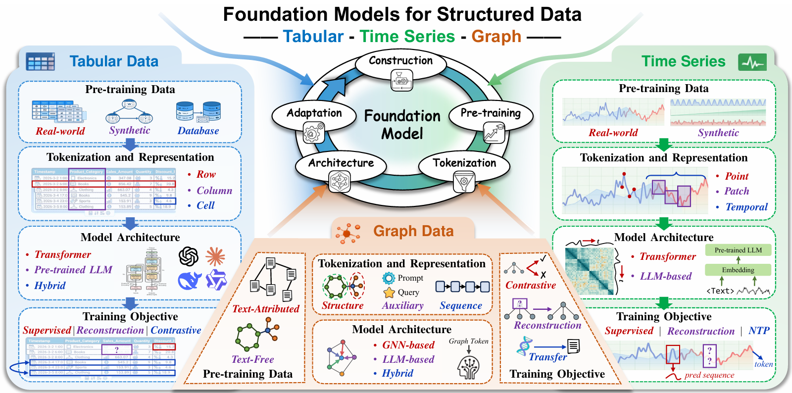

# Awesome Structured Data Foundation Models

A curated and continuously updated list of papers, code, and resources for **Foundation Models on Structured Data**.

This repository is the official repository for our survey:
> ***A Survey on Foundation Models for Structured Data: Tabular, Time Series, and Graphs***

## ✨ Highlights

- Three major structured data types: Tabular, Time Series, and Graph Foundation Models
- Unified comparison schema: data/tasks, objective, tokenization, architecture, adaptation and advance
- Includes benchmark and dataset resources for fast entry and reproducible research

## 🚀 Quick Links

- [Awesome Structured Data Foundation Models](#awesome-structured-data-foundation-models)
  - [✨ Highlights](#-highlights)
  - [🚀 Quick Links](#-quick-links)
  - [📊 Tabular Foundation Models](#-tabular-foundation-models)
    - [🔹 Overview](#-overview)
  - [⏱️ Time Series Foundation Models](#️-time-series-foundation-models)
    - [🔹 Overview](#-overview-1)
  - [🕸️ Graph Foundation Models](#️-graph-foundation-models)
    - [🔹 Overview](#-overview-2)
  - [📚 Benchmarks \& Datasets](#-benchmarks--datasets)
  - [🧰 Resources](#-resources)

---

## 📊 Tabular Foundation Models

### 🔹 Overview

| Model | Paper | Code | Pretraining Data | Pre-training Objective & Task | Tokenization | Architecture | Adaptation | Transfer | Task | Venue |
|------|------------------|------------------------------|-------------|-------------|-----------|---------|------|------|------|------|
| MITRA | [paper](https://openreview.net/pdf?id=t8YRsWY6HM) | [HF(classifier)](https://huggingface.co/autogluon/mitra-classifier) [HF(regressor)](https://huggingface.co/autogluon/mitra-regressor) | Synthetic (SCM, tree-based) | Classification, Regression | Cell | Transformer | FT, ICL | 1:N | CLS, REG | NeurIPS 2025 |
| UniTabE | [paper](https://proceedings.iclr.cc/paper_files/paper/2024/file/765c6e0249a301664092b16a39643f88-Paper-Conference.pdf) | [code](https://github.com/OldBirdAZ/UniTabE) | Real-world datasets | Masked cell prediction + Row-wise contrastive | Name-Value | Transformer | FT | N:N | CLS, REG | ICLR 2024 |
| CARTE | [paper](https://proceedings.mlr.press/v235/kim24d.html) | [code](https://www.nature.com/articles/s41586-024-08328-6.pdf) | Knowledge base | Contrastive (graphlet & truncation) | Row | Transformer | FT | N:N | CLS, REG | ICML 2024 |
| PORTAL | [paper](https://arxiv.org/abs/2410.13516) | [code](https://github.com/SAP-samples/portal) | Real-world datasets | Masked cell modeling | Row | Transformer | FT | N:N | CLS, REG | NeurIPS 2024 (WS) |
| TabForestPFN | [paper](https://arxiv.org/pdf/2405.13396) | [code](https://github.com/FelixdenBreejen/TabForestPFN) | Synthetic (SCM, tree-based) | Classification | Cell | Transformer | FT, ICL | 1:N | CLS | arXiv 2024 |
| TabPFNv2 | [paper](https://www.nature.com/articles/s41586-024-08328-6.pdf) | [code](https://github.com/PriorLabs/TabPFN) | Synthetic (SCM) | Masked cell prediction | Cell | Transformer | ICL | 1:N | CLS, REG | Nature 2025 |
| TabICL | [paper](https://openreview.net/pdf?id=0VvD1PmNzM) | [code](https://github.com/soda-inria/tabicl) | Synthetic (SCM, tree-based) | Classification | Row | Transformer | ICL | 1:N | CLS | ICML 2025 |
| TabDPT | [paper](https://openreview.net/pdf?id=pIZxEOZCId) | [train code](https://github.com/layer6ai-labs/TabDPT-training)  [infer code](https://github.com/layer6ai-labs/TabDPT-inference) | Real-world datasets | Masked column prediction | Row | Transformer | ICL | N:N | CLS, REG | NeurIPS 2025 |
| TabSTAR | [paper](https://openreview.net/pdf?id=FrXHdcTEzE) | [code](https://github.com/alanarazi7/TabSTAR) | Real-world datasets | Classification, Regression | Name-Value | Transformer | FT | N:N | CLS, REG | NeurIPS 2025 |
| TABULA | [paper](https://openreview.net/pdf?id=Vk2sfKAdeu) | [code](https://github.com/aristoteleo/tabula) | Real-world datasets | Column-wise reconstruction | Name-Value | Transformer | FT | N:N | IMP | NeurIPS 2025 |
| TARTE | [paper](https://arxiv.org/pdf/2505.14415) | [code](https://github.com/soda-inria/tarte-ai) | Knowledge base | Contrastive (entities & facts) | Name-Value | Transformer | FT | N:N | CLS, REG | TMLR 2025 |
| LimiX | [paper](https://arxiv.org/pdf/2509.03505) | [code](https://github.com/limix-ldm-ai/LimiX) | Synthetic (SCM) | Context-conditional masked modeling | Cell | Transformer | ICL | 1:N | CLS, REG, IMP, GEN | arXiv 2025 |
| Real-TabPFN | [paper](https://arxiv.org/pdf/2507.03971?) | [HF](https://huggingface.co/Prior-Labs/TabPFN-v2-clf/blob/main/tabpfn-v2-classifier-finetuned-zk73skhh.cpkt) | Synthetic + Real-world | Classification | Cell | Transformer | ICL | 1:N | CLS | arXiv 2025 |
| TabLLM | [paper](https://proceedings.mlr.press/v206/hegselmann23a/hegselmann23a.pdf) | [code](https://github.com/clinicalml/TabLLM) | Text | Table-to-text generation | Name-Value | LLM | FT | 1:N | CLS | AISTATS 2023 |
| UniPredict | [paper](https://arxiv.org/pdf/2310.03266) | -- | Real-world datasets | Table-to-text generation | Name-Value | LLM | IT | 1:N | CLS, REG | arXiv 2023 |
| TP-BERTa | [paper](https://openreview.net/pdf?id=anzIzGZuLi)            | [code](https://github.com/jyansir/tp-berta) | Real-world datasets | CLS, REG | Name-Value | LLM | FT | N:N | CLS, REG | ICLR 2024 |
| TABULA-8B | [paper](https://proceedings.neurips.cc/paper_files/paper/2024/file/4fd5cfd2e31bebbccfa5ffa354c04bdc-Paper-Conference.pdf) | [HF](https://huggingface.co/mlfoundations/tabula-8b) | Real-world datasets | Tabular prediction | Row | LLM | ICL | 1:N | CLS, REG | NeurIPS 2024 |
| IngesTables | [paper](https://openreview.net/pdf?id=EocsZtcA7P) | -- | Real-world datasets | Attention-based tabular modeling | Name-Value | Transformer + LLM | FT | N:N | CLS, REG | NeurIPS 2023 (WS) |

---

**Notes**

- **Adaptation**: "FT": Fine-Tuning; "ICL": In-Context Learning; "IT": Instruction Tuning  

- **Task**: "CLS": Classification; "REG": Regression; "IMP": Imputation; "GEN": Generation  

---

## ⏱️ Time Series Foundation Models

### 🔹 Overview

| Model | Paper | Code | Pretraining Data | Pre-training Objective & Task | Tokenization | Architecture | Adaptation | Transfer | Task | Venue |
|------|------------------|------------------------------|-------------|-------------|-----------|---------|------|------|------|------|
| ForecastPFN | [paper](https://proceedings.neurips.cc/paper_files/paper/2023/file/0731f0e65559059eb9cd9d6f44ce2dd8-Paper-Conference.pdf) | [code](https://github.com/abacusai/ForecastPFN) | Synthetic (periodicity) | Point forecasting | Point | Transformer | - | 1:N | FCT | NeurIPS 2023 |
| Lag-Llama | [paper](https://arxiv.org/abs/2310.08278) | [code](https://github.com/time-series-foundation-models/lag-llama) | Real-world datasets | Probabilistic forecasting | Lag feature vector | Transformer | - | N:N | FCT | NeurIPS 2023 (WS) |
| TimeGPT-1 | [paper](https://arxiv.org/abs/2310.03589) | [code](https://github.com/Nixtla/nixtla) | Real-world datasets | Forecasting | Sliding window | Transformer | FT | N:N | FCT | arXiv 2023 |
| UniTime | [paper](https://dl.acm.org/doi/pdf/10.1145/3589334.3645434) | [code](https://github.com/liuxu77/UniTime) | Real-world datasets | Forecasting + Reconstruction | Fixed-length patch | Transformer | ICL | N:N | FCT | WWW 2024 |
| TimesFM | [paper](https://openreview.net/pdf?id=jn2iTJas6h) | [code](https://github.com/google-research/timesfm) | Synthetic + Real-world | Point forecasting | Fixed-length patch | Transformer | FT | N:N | FCT | ICML 2024 |
| MOMENT | [paper](https://proceedings.mlr.press/v235/goswami24a.html) | [code](https://github.com/moment-timeseries-foundation-model/moment) | Real-world datasets | Masked reconstruction | Fixed-length patch | Transformer | FT | N:N | FCT, CLS, IMP, AD | ICML 2024 |
| MOIRAI | [paper](https://proceedings.mlr.press/v235/woo24a.html) | [code](https://github.com/SalesforceAIResearch/uni2ts) | Real-world datasets | Probabilistic forecasting | Adaptive patch | Transformer | ICL | N:N | FCT | ICML 2024 |
| Timer | [paper](https://arxiv.org/abs/2402.02368) | [code](https://github.com/thuml/Large-Time-Series-Model) | Real-world datasets | Next token prediction | Fixed-length patch | Transformer | - | N:N | FCT, IMP, AD | ICML 2024 |
| UniTS | [paper](https://proceedings.neurips.cc/paper_files/paper/2024/file/fe248e22b241ae5a9adf11493c8c12bc-Paper-Conference.pdf) | [code](https://github.com/mims-harvard/UniTS) | Real-world datasets | Masked reconstruction | Fixed-length patch | Transformer | PL | N:N | FCT, CLS, IMP, AD | NeurIPS 2024 |
| Time-MoE | [paper](https://openreview.net/pdf?id=e1wDDFmlVu) | [code](https://github.com/Time-MoE/Time-MoE) | Real-world datasets | Multi-resolution forecasting | Point | Transformer | FT, ICL | N:N | FCT | ICLR 2025 |
| WaveToken | [paper](https://openreview.net/pdf?id=B6WalMoQJW) | -- | Real-world datasets | Next token prediction | Wavelet | Transformer | ICL | N:N | FCT | ICML 2025 |
| ROSE | [paper](https://proceedings.mlr.press/v267/wang25ci.html)    | -- | Real-world datasets | Masked reconstruction | Fixed-length patch | Transformer | FT | N:N | FCT | ICML 2025 |
| GPT4TS | [paper](https://papers.nips.cc/paper_files/paper/2023/file/86c17de05579cde52025f9984e6e2ebb-Paper-Conference.pdf) | [code](https://github.com/ekto42/GPT4TS) | - | - | Fixed-length patch | LLM | FT | 1:N | FCT, CLS, IMP, AD | NeurIPS 2023 |
| LLMTime | [paper](https://proceedings.neurips.cc/paper_files/paper/2023/file/3eb7ca52e8207697361b2c0fb3926511-Paper-Conference.pdf) | [code](https://github.com/ngruver/llmtime) | - | - | Point / digit sequence | LLM | - | 1:N | FCT | NeurIPS 2023 |
| PromptCast | [paper](https://ieeexplore.ieee.org/abstract/document/10356715) | [code](https://github.com/cruiseresearchgroup/PISA-PromptCast) | - | - | Point / digit sequence | LLM | FT | 1:N | FCT | TKDE 2023 |
| GPT4MTS | [paper](https://ojs.aaai.org/index.php/AAAI/article/view/30383) | [code](https://github.com/Flora-jia-jfr/GPT4MTS-Prompt-based-Large-Language-Model-for-Multimodal-Time-series-Forecasting) |  |  |  |  |  |  |  | AAAI 2024 |
| TIME-LLM | [paper](https://openreview.net/pdf?id=Unb5CVPtae) | [code](https://github.com/KimMeen/Time-LLM) | - | - | Fixed-length patch | LLM | PL | 1:N | FCT | ICLR 2024 |
| AutoTimes | [paper](https://proceedings.neurips.cc/paper_files/paper/2024/file/dcf88cbc8d01ce7309b83d0ebaeb9d29-Paper-Conference.pdf) | [code](https://github.com/thuml/AutoTimes) | Real-world datasets | Next token prediction | Fixed-length patch | LLM | PL, ICL | N:N | FCT | NeurIPS 2024 |
| Chronos | [paper](https://openreview.net/pdf?id=gerNCVqqtR) | [code](https://github.com/amazon-science/chronos-forecasting) | Real + Synthetic | Autoregressive density estimation | Quantization | LLM | - | N:N | FCT | TMLR 2024 |
| CALF | [paper](https://ojs.aaai.org/index.php/AAAI/article/view/34082) | [code](https://github.com/Hank0626/CALF) | - | - | Text + TS embedding | LLM | FT | N:N | FCT | AAAI 2025 |
| LLM4TS | [paper](https://dl.acm.org/doi/epdf/10.1145/3719207) | [code](https://github.com/blacksnail789521/LLM4TS) | - | Autoregressive alignment | Fixed-length patch | LLM | FT | 1:N | FCT | TIST 2025 |
| LLM-Mixer | [paper](https://aclanthology.org/2025.trl-1.12.pdf) | [code](https://github.com/Kowsher/LLMMixer) | - | - | Text + TS embedding | LLM | FT | 1:N | FCT | ACL 2025 (WS) |
| TEMPO | [paper](https://openreview.net/pdf?id=YH5w12OUuU) | [code](https://github.com/DC-research/TEMPO) | - | Point forecasting | Fixed-length patch | Transformer + LLM | PL | N:N | FCT | ICLR 2024 |

---

**Notes**

- **Adaptation**: "FT": Fine-Tuning; "PL": Prompt Learning; "ICL": In-Context Learning  

- **Task**: "FCT": Forecasting; "CLS": Classification; "IMP": Imputation; "AD": Anomaly Detection  

---

## 🕸️ Graph Foundation Models

### 🔹 Overview
| Model | Paper | Code | Pretraining Data | Pre-training Objective & Task | Tokenization | Architecture | Adaptation | Transfer | Task | Venue |
|------|------------------|------------------------------|-------------|-------------|-----------|---------|------|------|------|------|
| GraphPrompt | [paper](https://arxiv.org/pdf/2302.08043) | [code](https://github.com/Starlien95/GraphPrompt) | Text-free | Subgraph similarity | Subgraph | GNN | PL | 1:1 | NC, GC | WWW 2023 |
| HGPrompt | [paper](https://ojs.aaai.org/index.php/AAAI/article/view/29596) | [code](https://github.com/Starlien95/HGPrompt) | Text-free | Subgraph similarity | Subgraph | GNN | PL | 1:1 | NC, GC | AAAI 2024 |
| GCOPE | [paper](https://dl.acm.org/doi/abs/10.1145/3637528.3671913) | [code](https://github.com/cshhzhao/GCOPE) | Text-free | Contrastive + feature reconstruction | Node | GNN | FT, PL | N:N | NC | KDD 2024 |
| MultiGPrompt | [paper](https://arxiv.org/pdf/2312.03731) | [code](https://github.com/Nashchou/MultiGPrompt/tree/main) | Text-free | Subgraph similarity | Encoder layer | GNN | PL | 1:1 | NC, GC | WWW 2024 |
| OpenGraph | [paper](https://aclanthology.org/2024.findings-emnlp.132.pdf) | [code](https://github.com/HKUDS/OpenGraph/tree/main) | Text-free | Masked autoencoding | Node | GNN | - | N:N | NC, LP | EMNLP 2024 |
| GFT | [paper](https://proceedings.neurips.cc/paper_files/paper/2024/file/c23ccf9eedf87e4380e92b75b24955bb-Paper-Conference.pdf) | [code](https://github.com/Zehong-Wang/GFT) | Text-attributed | Tree reconstruction | Computation tree | GNN | FT | N:N | NC, GC, LP | NeurIPS 2024 |
| AnyGraph | [paper](https://arxiv.org/pdf/2408.10700) | [code](https://github.com/HKUDS/AnyGraph) | Text-free | Link prediction | Node | GNN | FT | 1:N | NC, GC, LP | arXiv 2024 |
| MDGPT | [paper](https://arxiv.org/pdf/2405.13934) | -- | Text-free | Subgraph similarity | Domain | GNN | PL | N:N | NC, GC | arXiv 2024 |
| OMOG | [paper](https://arxiv.org/pdf/2412.00315) | -- | Text-attributed | Contrastive pretraining | Node | GNN | - | N:N | NC, LP | arXiv 2024 |
| GraphMoRE | [paper](https://ojs.aaai.org/index.php/AAAI/article/view/33279) | [code](https://github.com/Vic-GoodLuck/GraphMoRE) | Text-free | Topology heterogeneity modeling | Node | GNN | FT | 1:1 | NC, LP | AAAI 2025 |
| GraphAny | [paper](https://openreview.net/pdf?id=1Qpt43cqhg) | [code](https://github.com/DeepGraphLearning/GraphAny) | Text-free | Node classification | Node | GNN | - | 1:N | NC | ICLR 2025 |
| GraphPrompter | [paper](https://ieeexplore.ieee.org/document/11113174) | [code](https://github.com/karin0018/GraphPrompter) | Text-free | Neighbor matching + reconstruction | Subgraph | GNN | ICL | N:N | NC, GC, LP | ICDE 2025 |
| BRIDGE | [paper](https://openreview.net/pdf?id=bjDKZ3Roax) | [code](https://github.com/RingBDStack/BRIDGE) | Text-free | Subgraph similarity | Aligner | GNN | PL | N:N | NC, GC | ICML 2025 |
| GIT | [paper](https://openreview.net/pdf?id=BSqf2k01ag) | [code](https://github.com/Zehong-Wang/GIT) | Text-attributed | Tree reconstruction | Task tree | GNN | FT, IT, ICL | N:N | NC, GC, LP | ICML 2025 |
| MDGFM | [paper](https://openreview.net/pdf?id=44Wq2xeRF0) | [code](https://github.com/wbkzwqtzw/MDGFM) | Text-free | Subgraph similarity | Domain | GNN | PL | N:N | NC | ICML 2025 |
| AutoGFM | [paper](https://openreview.net/pdf?id=fCPB0qRJT2) | -- | Text-attributed | Disentangled contrastive learning | Subgraph | GNN | FT | N:N | NC, GC, LP | ICML 2025 |
| GCoT | [paper](https://dl.acm.org/doi/pdf/10.1145/3711896.3736974) | -- | Text-free | Link prediction | Node | GNN | PL | 1:1 | NC, GC | KDD 2025 |
| PatchNet | [paper](https://dl.acm.org/doi/pdf/10.1145/3690624.3709242) | [code](https://github.com/zjunet/PatchNet) | Text-free | Attribute masking + context prediction | Node patch | GNN | FT | N:N | NC, GC | KDD 2025 |
| SAMGPT | [paper](https://arxiv.org/abs/2502.05424) | [code](https://github.com/blue-soda/SAMGPT) | Text-free | Subgraph similarity | Structural token | GNN | PL | N:N | NC, GC | WWW 2025 |
| UniGraph2 | [paper](https://arxiv.org/abs/2502.00806) | [code](https://github.com/yf-he/UniGraph2) | Multimodal | Reconstruction | Node | GNN | - | N:N | Multimodal | WWW 2025 |
| RiemannGFM | [paper](https://dl.acm.org/doi/epdf/10.1145/3696410.3714952) | [code](https://github.com/RiemannGraph/RiemannGFM) | Text-attributed + Text-free | Geometric contrastive learning | Subgraph | GNN | FT | N:N | NC, LP | WWW 2025 |
| GraphCLIP | [paper](https://arxiv.org/abs/2410.10329) | [code](https://github.com/ZhuYun97/GraphCLIP) | Text-attributed | Contrastive alignment | Subgraph | GNN | PL | N:N | NC, LP | WWW 2025 |
| UniPrompt | [paper](https://openreview.net/pdf?id=xJ2lGfFOv7) | [code](https://github.com/hedongxiao-tju/UniPrompt) | Text-free | - | Prompt graph | GNN | PL | N:N | NC | NeurIPS 2025 |
| GraphKeeper | [paper](https://openreview.net/pdf?id=AIlaBrwwJO) | [code](https://github.com/Vic-GoodLuck/GraphKeeper) | Text-free | Continual pretraining | Node | GNN | FT | N:1 | NC, GC | NeurIPS 2025 |
| H²GFM | [paper](https://arxiv.org/abs/2506.08298) | -- | Text-attributed | Text-space encoding + context-path modeling | Node | GNN | - | N:N | NC, LP | arXiv 2025 |
| RWPT | [paper](https://arxiv.org/pdf/2506.14098) | -- | Text-attributed | Contrastive pretraining | Node sequence | GNN | FT | N:N | NC, GC, LP | arXiv 2025 |
| MDGCL | [paper](https://arxiv.org/pdf/2506.22510) | -- | Text-free | Contrastive pretraining | Subgraph | GNN | FT | N:1 | NC, GC | arXiv 2025 |
| GILT | [paper](https://arxiv.org/pdf/2510.04567) | -- | Text-free | Few-shot meta-pretraining | Node/Edge/Graph | GNN | ICL | N:N | NC, GC, LP | arXiv 2025 |
| GMoPE | [paper](https://arxiv.org/pdf/2511.03251) | -- | Text-free | Contrastive pretraining | Node | GNN | FT | N:N | NC, GC, LP | arXiv 2025 |
| GraphGlue | [paper](https://arxiv.org/pdf/2603.00618) | [code](https://github.com/RiemannGraph/GraphGlue) | Text-free | Geometric pretraining | Manifold patch | GNN | FT, PL | N:1 | NC, GC, LP | ICLR 2026 |
| LLaGA | [paper](https://proceedings.mlr.press/v235/chen24bh.html) | [code](https://github.com/VITA-Group/LLaGA) | Text-attributed | Alignment tuning | Node sequence | LLM | IT | N:N | NC, LP | ICML 2024 |
| LangGFM | [paper](https://arxiv.org/pdf/2410.14961) | [code](https://github.com/Lintianqianjin/LangGFM) | Mixed | Instruction tuning | Text | LLM | IT, ICL | N:N | NC, GC, LP | arXiv 2024 |
| PromptGFM | [paper](https://arxiv.org/pdf/2503.03313) | [code](https://github.com/agiresearch/PromptGFM) | Text-attributed | Multi-task instruction tuning | Node | LLM | IT | N:N | NC, LP | arXiv 2025 |
| OFA | [paper](https://openreview.net/pdf?id=4IT2pgc9v6) | [code](https://github.com/LechengKong/OneForAll) | Text-attributed | Graph classification | Subgraph | GNN + LLM | PL, ICL | N:N | NC, GC, LP | ICLR 2024 |
| GraphGPT | [paper](https://dl.acm.org/doi/10.1145/3626772.3657775) | [code](https://github.com/HKUDS/GraphGPT) | Text-attributed | Contrastive alignment + matching | Subgraph | GNN + LLM | IT | N:N | NC, LP | SIGIR 2024 |
| ZeroG | [paper](https://dl.acm.org/doi/epdf/10.1145/3637528.3671982) | [code](https://github.com/NineAbyss/ZeroG) | Text-attributed | Semantic similarity | Node/Subgraph | GNN + LLM | - | N:N | NC | KDD 2024 |
| GOFA | [paper](https://openreview.net/pdf?id=mIjblC9hfm) | [code](https://github.com/JiaruiFeng/GOFA) | Text-attributed | Generative modeling | Node/Edge | GNN + LLM | IT | N:N | NC, GC, LP | ICLR 2025 |
| UniGraph | [paper](https://dl.acm.org/doi/pdf/10.1145/3690624.3709277) | [code](https://github.com/yf-he/UniGraph) | Text-attributed | Text reconstruction | Node/Subgraph | GNN + LLM | IT, ICL | N:N | NC, GC, LP | KDD 2025 |
| BooG | [paper](https://arxiv.org/pdf/2407.19941) | [code](https://github.com/cy623/BooG) | Text-attributed | Super-node matching | Subgraph | GNN + LLM | FT | N:N | NC, GC, LP | FCS 2025 |
| GRAVER | [paper](https://openreview.net/pdf?id=tyERwC5520) | [code](https://github.com/RingBDStack/GRAVER) | Text-attributed | Subgraph similarity | Subgraph | GNN + LLM | PL | N:N | NC, GC | NeurIPS 2025 |
| SA²GFM | [paper](https://openreview.net/pdf?id=bjDKZ3Roax) | [code](https://github.com/RingBDStack/BRIDGE) | Text-attributed | Subgraph similarity | Node + structural entropy | GNN + LLM | PL | N:N | NC, GC | AAAI 2026 |

---

**Notes**

- **Adaptation**: "FT": Fine-Tuning; "PL": Prompt Learning; "IT": Instruction Tuning; "ICL": In-Context Learning  

- **Task**: "NC": Node Classification; "GC": Graph Classification; "LP": Link Prediction  
---

## 📚 Benchmarks & Datasets

| Data | Name | Description | Paper | Code | Web |
|------|------------|------|------|------|------|
| Tabular | OpenTabs | Large-scale table dataset | [paper](https://arxiv.org/pdf/2307.04308) | [code](https://github.com/Chao-Ye/CM2) | -- |
| Tabular | TabArena | Tabular benchmark | [paper](https://arxiv.org/abs/2506.16791) | [code](https://github.com/autogluon/tabarena) | https://tabarena.ai |
| Tabular | -- | Benchmarking Privacy Leakage | [paper](https://arxiv.org/pdf/2507.17066) | -- | -- |
| Tabular | TabularFM | Open Framework | [paper](https://arxiv.org/abs/2406.09837) | [code](https://github.com/tabularfm/TabularFM) | https://tabularfm.github.io/ |
| Time Series | TSFM-Bench | Benchmark for TSFM | [paper](https://arxiv.org/pdf/2410.11802) | [code](https://github.com/decisionintelligence/TSFM-Bench) | -- |
| Time Series | LTSM-Bundle | Toolbox/Bench on LLM for Time Series Forecasting | [paper](https://arxiv.org/pdf/2406.14045v2) | [code](https://github.com/datamllab/ltsm) | https://ltsm-doc.github.io/ |
| Time Series | PriceFM | Benchmark for Probabilistic Electricity Price Forecasting | [paper](https://arxiv.org/pdf/2508.04875v1) | [code](https://github.com/runyao-yu/PriceFM) | https://runyao-yu.com/PriceFM/ |
| Graph | TSGFM | Bench/Dataset for Text-space GFM | [paper](https://proceedings.neurips.cc/paper_files/paper/2024/file/0e0b39c69663e9c073739adf547ed778-Paper-Datasets_and_Benchmarks_Track.pdf) | [Code](https://github.com/CurryTang/TSGFM) | -- |
| Graph | GFMBench | Benchmark + Pipeline | [paper](https://dl.acm.org/doi/10.1145/3711896.3737410) | [code](https://github.com/BUPT-GAMMA/ggfm) | https://ggfm.readthedocs.io/en/latest/ |
| Graph | GFMBenchmark | Codebase for GFM | [paper](https://arxiv.org/pdf/2603.10033) | [code](https://github.com/smufang/GFMBenchmark) | -- |
|  | | | | | |

---

## 🧰 Resources

- 📄 Survey Paper: xxx
- 🌏 Cite:
  > @article{XXX}

